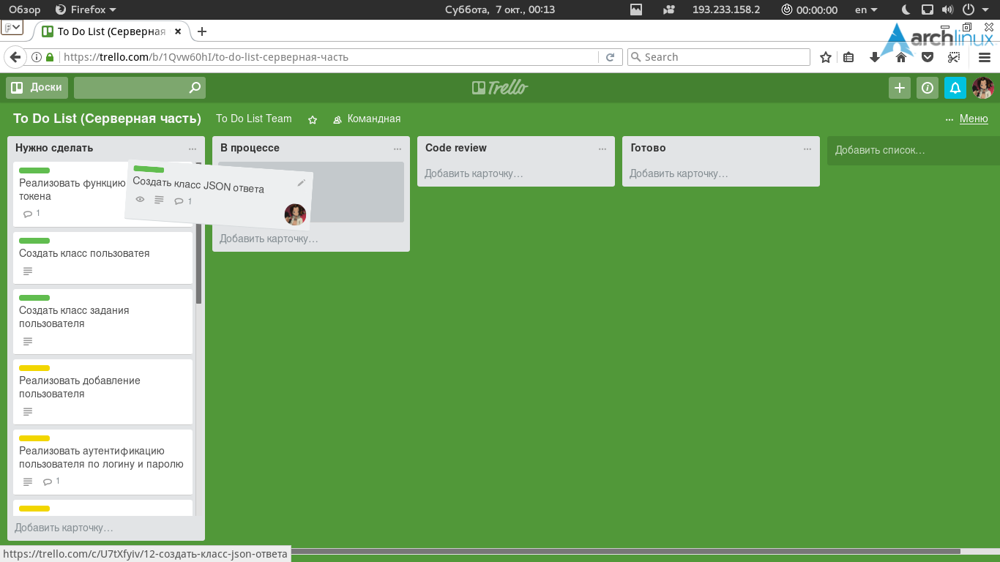
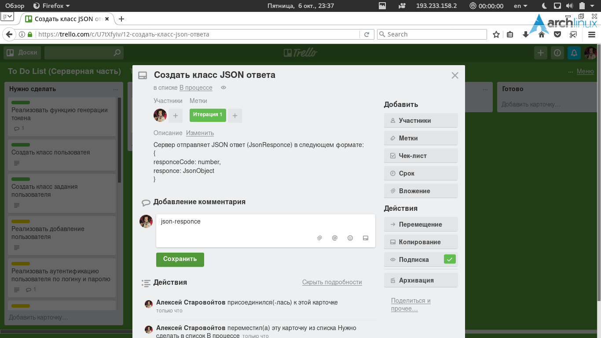
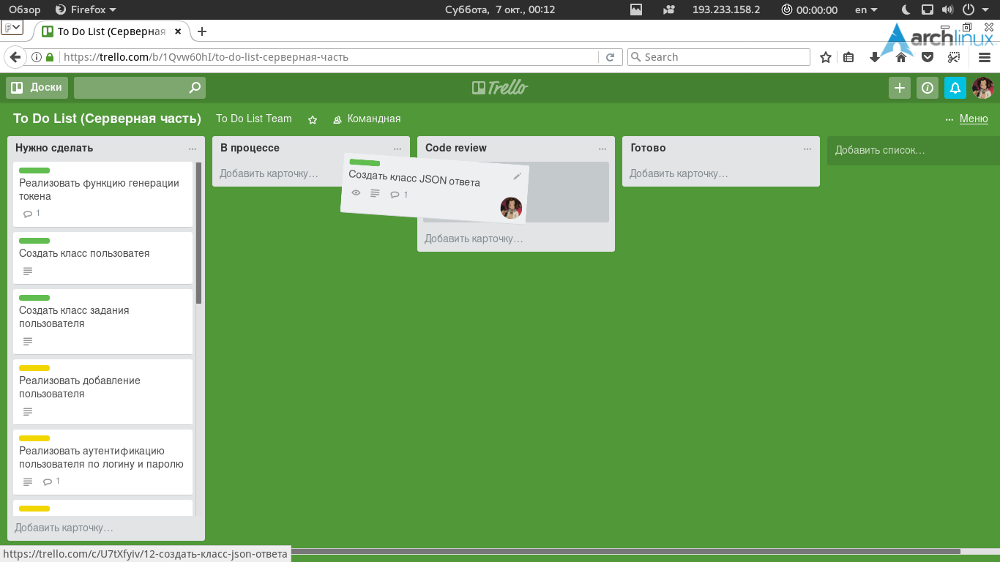
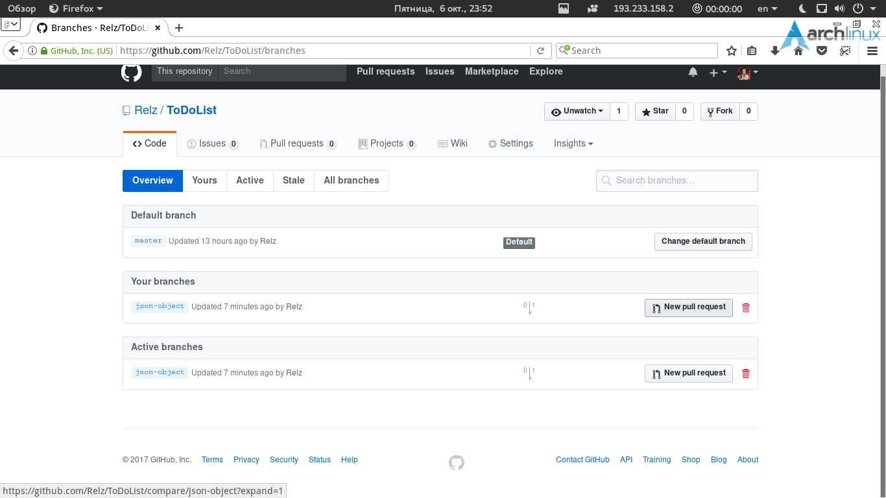
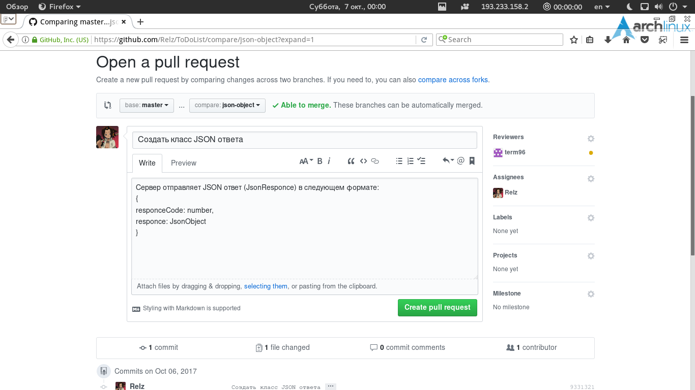
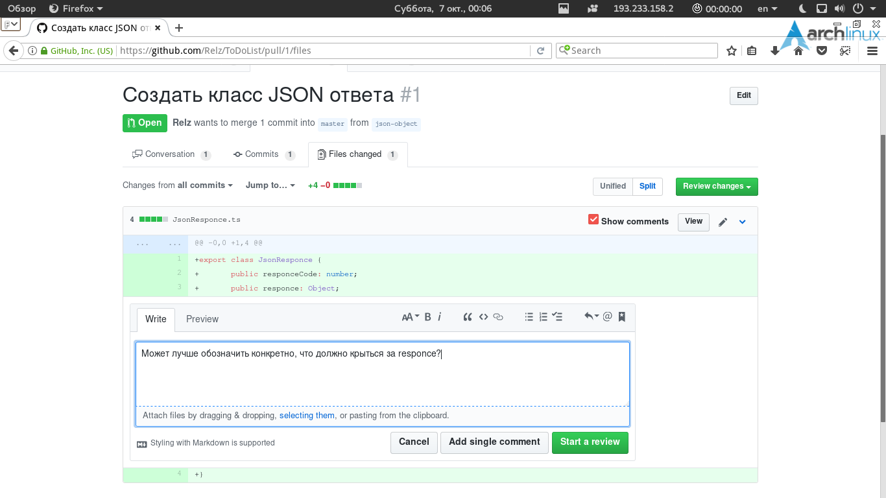
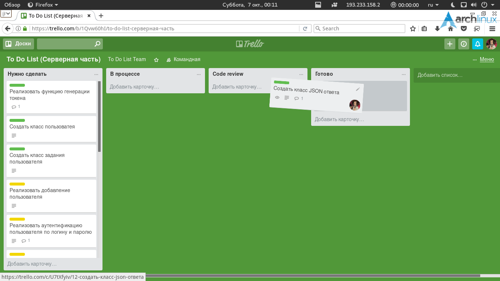

# To Do List
## Заметки разработчикам:
- Каждое подзадание должно иметь свою ветку, отпочкованной от локальной ветки **master**.
    - Пример выполнения в терминале:
```
git checkout master
git checkout -b new-branch
```
- Перед созданием новой ветки убедитесь, обновлена ли локальная ветка **master**.
    - Пример выполнения в терминале:
```
git checkout master
git pull
```

- После обновления ветки **master** из **remote** не забудьте выполнить команду установки пакетов NodeJS:
```
npm i
```
- Взяв подзадание, следует в комментарии указать название ветки, указать себя как **участника** и перенести его в Trello в колонку "В процессе":





- Сделав подзадание, следует перенести его в колонку "Code review". Также нужно открыть Pull request своей ветки в ветку **master**, указав остальных членов команды как **экспертов по рассмотрению**. Остальные участники команды проверяют код, и если находят недочёт, то оставляют комментарий к коду:









- Выполняющий перетаскивает подзадание в "В процессе", исправляя недочёты, затем снова в "Code review". И так цикл длится по тех пор, пока код не станет идеальным в лице всех участников. 

- Если участник Code review не обнаружил никаких ошибок, ему следует выразить своё согласие с кодом, нажав на "Approve".

- Когда все участники Code review согласились с кодом, его владелец схлапывает все свои коммиты в один, в комментарии коммита указывая название и описание подзадачи в Trello, сливает свою ветку с веткой **master**, удаляет свою ветку(локальную и удалённую) и переносит подзадание в колонку "Готово".



- Перед слиянием нужно убедиться, что ветка подзадачи исходит из актуальной ветки **master**. Не исходить она может только в том случае, если во время разработки подзадачи кто-то изменил ветку **master**, тем самым все отпочкованные ранее ветки стали исходить из неактуальной, прошедшей ветки **master**. В этом случае нужно сделать **Rebase**:
    - обновляем локальную ветку **master**;
    - переключаемся на ветку подзадачи;
    - выполняем функцию git: rebase, относительно локальной ветки **master**;
    - если в процессе rebase система уведомит о конфликте, самым важным в такой ситуации является сохранение работоспособности кода;
    - когда всё завершится успешно, сделайте **принудительный push**, и удалённая ветка подзадачи станет исходить из актуальной ветки **master**.
